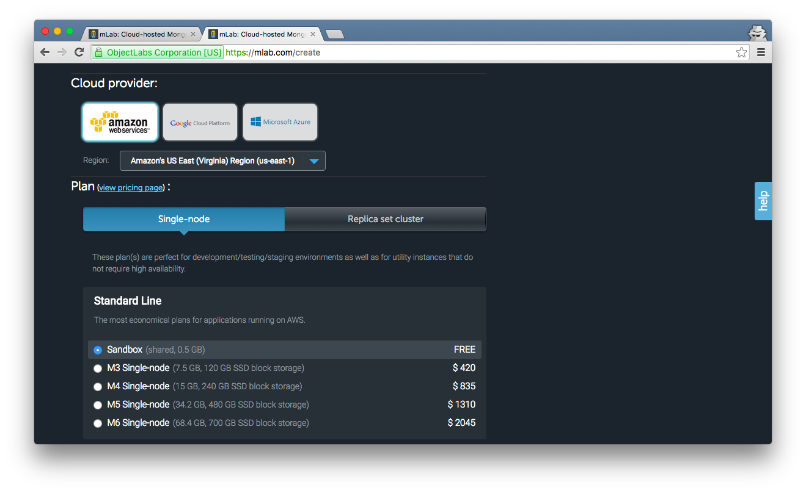

# Inline exercise: Setting up MongoDB with mLab.com

## Instructions

We're going to use them to store (semi) structured data for our Express
applications using MongoDb. [mLab](https://mlab.com/) is a MongoDb hosting service.
It lets you create, view and edit Mongo databases.

In this exercise, we'll set up our own database with sample data in it.

1. Go to [https://mlab.com/signup/](https://mlab.com/signup/) and sign up for an account.
1. Open up your email account and verify your email address.
1. Click `Create New` on the right side of the page to create a Database. If you see two "Create New" buttons, click the one next to "MongoDB Deployments".

    

1. Select `Single-node` and `Sandbox`

    

1. Type in `horizons` as the database name and click `Create new MongoDB deployment`

    

1. Wait for the green checkmark indicating the database is ready. Then click on the database to open it.

    

1. Click `Users > Add Database User` to create a new user.

    

1. Pick a username and password for the database user. Make sure
to save this information somewhere, we'll use it later.
You can use the same username and password as your mLab login
but it doesn't have to be.

    

1. Switch to the `Collections` tab, click `Add collection`. Type in `warmup` as collection name.

    

1. Click on `warmup` on the list of collections, then click `Add document`

    

1. Create document containing:

    ```json
    {"mongo": "awesome", "score": 10}
    ```

    Then click `Create and go back`.

    

1. Click on `Start new search`, and select `[new search]`.

    

1. Type then following in search, then click `Search`.

    ```json
    {"score": 10}
    ```

    You should see a record show up in the gray box. Congratulations, you've set up MongoDb!

    
